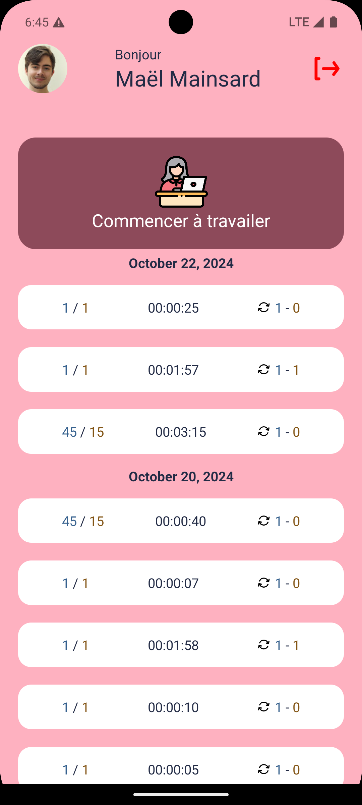
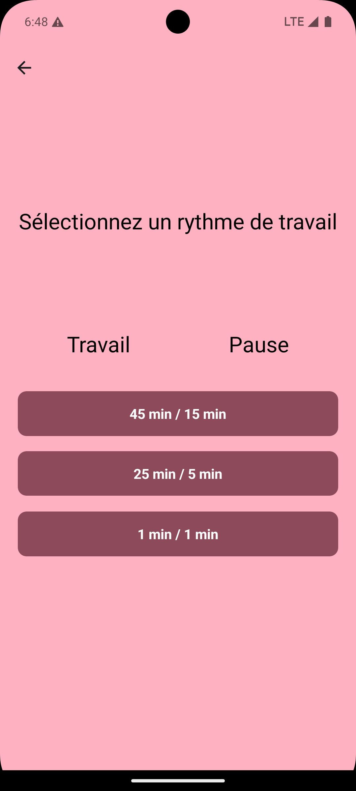
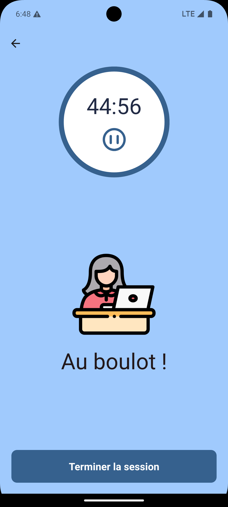
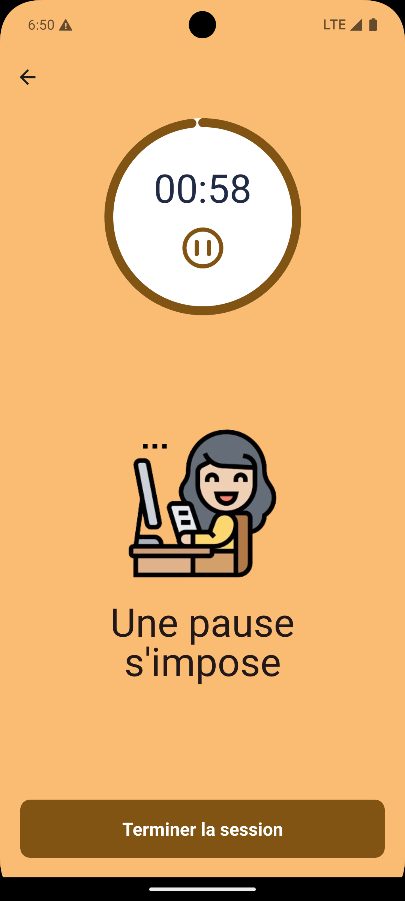

<div align="center">


<h3 align="center">Pomodoro - React Native</h3>

<p align="center">
    Un timer pomodoro crée en react native 🚀
</p>
</div>


## A propos du projet

Pomodoro est une application qui propose un minuteur avec plusieurs modes pour travailler selon la technique Pomodoro 🍅. Ce projet a été développé dans le cadre d'un cours de développement mobile multiplateforme 📱.

<div style="display: flex">




</div>

### Fonctionnalitées:

- 3 modes (Temps de travail / Temps de repos) :
    - 45 min / 15 min 🕒
    - 25 min / 5 min ⏳
    - 1 min / 1 min ⏱️
- Le minuteur fonctionne en arrière-plan, vous permettant d'utiliser d'autres applications pendant son activation 🕒.
- Possibilité d'arrêter ou de mettre le minuteur en pause ⏸️.
- Une notification avec un son personnalisé 🎶 vous alerte lorsque le minuteur est terminé, vous rappelant de passer entre les modes de travail et de repos 🔔.
- Connectez-vous avec votre compte Google pour accéder à votre historique de sessions 🗓️.

⚠️ Si vous n'êtes pas connecté ou si vous fermez l'application, la session ne sera pas enregistrée dans l'historique.

### Compatibilitées

- **Android** 📱
    - Version minimale requise : `Android 5.0` (niveau API 21).
    - Version recommandée : `>= Android 10` (niveau API 29).

- **iOS** 🍏
    - Version minimale requise : `iOS 12`.
    - Version recommandée : `iOS 13`.

- **Web** 🌐 : `Non pris en charge`.


### Technologies Utilisées dans Pomodoro 🚀

#### Frameworks 🧩
- ![React Native][React-Native.js]
- [![Expo][Expo.js]][Expo-url]

#### Langages de Développement 💻
- ![JavaScript][JavaScript.js]
- ![TypeScript][TypeScript.js]

#### Bibliothèque de Composants 🧱
- 

#### Base de Données 🗄️
- 

#### Authentification 🔐
- 

---

## Mise en Route

Avant d'utiliser le code du projet, assurez-vous d'avoir les prérequis corrects ✅.

### Prérequis

* **Node.js** : `>= v21.7.3`
* **Java** : `>= 17.0.12`
* Fichier de variables d'environnement : `env.ts`
* Fichier de configuration Firebase pour Android : `google-services.json`
* Fichier de configuration Firebase pour iOS : `GoogleService-Info.plist`

### Installation

Veuillez suivre attentivement le guide d'installation 📝 pour éviter des problèmes au démarrage 🚀.

1. Clonez le dépôt
   ```sh
   git clone https://github.com/github_username/repo_name.git
   ```
2. Installez les packages npm
   ```sh
   npm install
   ```
3. Déplacez les fichiers `env.ts`, `google-services.json` et `GoogleService-Info.plist` à la racine du projet.
4. Créez les dossiers `android` et `ios` en préconstruisant le projet
   ```sh
   npx expo prebuild
   ```
---

## Optimisation

Pomodoro utilise un son personnalisé pour ses notifications. Malheureusement, cela peut retarder la notification push de quelques secondes.

Si ce délai pose problème, vous pouvez désactiver cette fonctionnalité en modifiant le fichier `hooks/useNotification.ts` :

```typescript
trigger: {} 
```

en

```typescript
trigger: null
```

---

## Utilisation

### Développement Android

Pour développer pour Android, il est préférable d'utiliser l'émulateur Android.

1. Lancez votre émulateur
   ```sh
   emulator @XXXXXX
   ```
2. Exécutez l'application sur l'émulateur
   ```sh
   npm run android
   ```
---

### Guide de Développement iOS 📱

Ce guide vous aidera à configurer un environnement iOS en utilisant un émulateur macOS, idéal si vous n'avez pas de Mac. Pour ceux qui en possèdent déjà un, passez directement à la section **Téléchargement de Xcode**.


#### Installation de l'Émulateur macOS 💻

Avant de commencer, assurez-vous de disposer d’au moins 60 Go d’espace de stockage libre et de 16 Go de RAM.

1. **Clonez le dépôt** de Docker-OSX :
   ```sh
   git clone https://github.com/sickcodes/Docker-OSX.git
   ```

2. **Placez-vous** à la racine du projet, puis exécutez cette commande :
   ```sh
   docker build -t sickcodes/docker-osx:sonoma --build-arg SHORTNAME=sonoma .
   ```

3. **Récupérez l'ID de l'image créée** avec cette commande :
   ```sh
   docker image list
   ```

4. **Lancez l'émulateur** en utilisant l'ID de l'image récupérée :
   ```sh
   sudo docker run -it --device /dev/kvm -p 50922:10022 -v /tmp/.X11-unix:/tmp/.X11-unix -e "DISPLAY=${DISPLAY:-:0.0}" -e GENERATE_UNIQUE=true -e CPU='Haswell-noTSX' -e CPUID_FLAGS='kvm=on,vendor=GenuineIntel,+invtsc,vmware-cpuid-freq=on' -e MASTER_PLIST_URL='https://raw.githubusercontent.com/sickcodes/osx-serial-generator/master/config-custom-sonoma.plist' -e SHORTNAME=sonoma -e RAM=8 [ID de l'image]
   ```

5. **Suivez les instructions de démarrage** :
    - Utilisez les flèches directionnelles pour sélectionner **macOS Base System** et appuyez sur Entrée.
    - **Mode plein écran** : faites `Ctrl + Alt + F` pour agrandir et `Ctrl + Alt + G` pour libérer la souris.

6. **Configuration de Disk Utility** :
    - Dans le menu d'installation de macOS, sélectionnez **Disk Utility**, puis **Continue**.
    - Choisissez le support avec le plus de stockage, cliquez sur **Erase**, nommez votre disque (ex. : `myMacOS`), puis confirmez avec **Erase**.

7. **Installation de macOS Sonoma** :
    - Quittez Disk Utility, cliquez sur **Reinstall macOS Sonoma** et suivez les instructions.
    - Une fois l'installation terminée, choisissez le disque que vous avez créé et suivez les instructions de configuration (n'oubliez pas de sélectionner **French - PC** pour le clavier).

---

#### Téléchargement de Xcode 🛠️

1. Ouvrez **Spotlight** (loupe en haut de l'écran) et recherchez **Software Update**.
2. Si **Safari** n'est pas à jour, procédez à sa mise à jour.
3. Ouvrez **Safari** et allez sur [xcodereleases.com](https://xcodereleases.com/).
4. Téléchargez **Xcode 16.0** en suivant les instructions (connexion à un compte Google requise).
5. Décompressez l'archive Xcode et déplacez l’application dans le dossier **Applications** de macOS.
6. Lancez Xcode pour installer les packages nécessaires pour le développement iOS 18.

---

#### Installation de Homebrew 🍺

1. Téléchargez le script d'installation de Homebrew :
   ```sh
   curl -fsSL https://raw.githubusercontent.com/Homebrew/install/master/install.sh -o install.sh
   ```
2. Exécutez le script depuis un terminal :
   ```sh
   /bin/bash path/to/install.sh
   ```

---

#### Installation des outils nécessaires ⚙️

1. **Node.js** :
   ```sh
   brew install node
   ```

2. **Git** :
   ```sh
   brew install git
   ```

3. **Watchman** :
   ```sh
   brew install watchman
   ```

4. **CocoaPods** :
   ```sh
   brew install cocoapods
   ```

---

#### Emulation d'iOS 🖥️

1. **Configuration du projet** : Assurez-vous d’être à la racine du projet, puis exécutez les étapes de l’installation iOS.
2. **Installation des dépendances iOS** : Depuis le dossier `ios` de votre projet, exécutez :
   ```sh
   pod install
   ```

3. **Lancement de l'émulateur iOS** : Ouvrez le simulateur iOS de votre choix et attendez qu'il s'initialise.

4. **Exécution de l'application** : Retournez à la racine du projet et lancez votre application iOS avec :
   ```sh
   npm run ios
   ```

5. 🎉 **Tout est prêt** ! Si tout s’est bien passé, votre application devrait maintenant se lancer sur l'émulateur iOS.


## Contributors

Les contributeurs de ce projet sont :
- Maël Mainsard
- Symeon Rougevin

## Contact

Maël Mainsard - mainsardm@gmail.com

[React-Native.js]: https://img.shields.io/badge/React_Native-20232A?style=for-the-badge&logo=react&logoColor=61DAFB
[React-Native-url]: https://reactnative.dev/

[Expo.js]: https://img.shields.io/badge/Expo-000020?style=for-the-badge&logo=expo&logoColor=white
[Expo-url]: https://expo.dev/

[JavaScript.js]: https://img.shields.io/badge/JavaScript-F7DF1E?style=for-the-badge&logo=javascript&logoColor=black
[JavaScript-url]: https://developer.mozilla.org/en-US/docs/Web/JavaScript

[TypeScript.js]: https://img.shields.io/badge/TypeScript-007ACC?style=for-the-badge&logo=typescript&logoColor=white
[TypeScript-url]: https://www.typescriptlang.org//react-native-ui-kitten/
